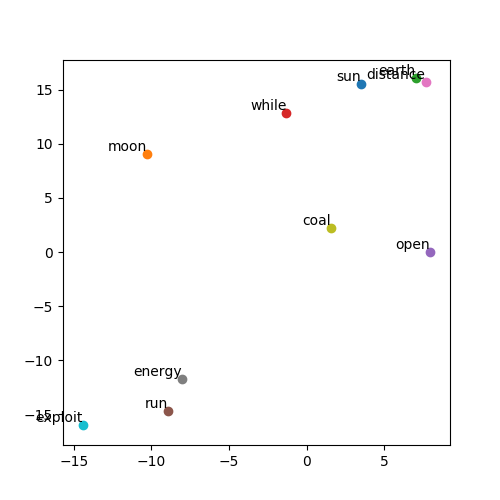

# Skip-Gram-Model-PyTorch
PyTorch implementation of the word2vec (skip-gram model) and visualization of the trained embeddings using TSNE !



My TensorFlow implemntation of Skip-Gram Model can be found [here](https://github.com/n0obcoder/Skip-Gram_Model-TensorFlow).

### Requirements
* torch >= 1.4    
* numpy >= 1.18      
* matplotlib       
* tqdm 
* nltk
* gensim


### Training
```
python main.py
```

### Visualizing real-time training loss in Tensorboard
```
tensorboard --logdir <PATH_TO_TENSORBOARD_EVENTS_FILE>
```
<strong>NOTE:</strong> By default, <strong>PATH_TO_TENSORBOARD_EVENTS_FILE</strong> is set to <strong>SUMMARY_DIR</strong> in config.py

### Testing
```
python test.py
```

### Inference

| war      | india   | crime     | guitar | movies  | desert   | physics      | religion     | football | computer    |  
| -------- | ------- | --------- | ------ | ------- | -------- | ------------ | ------------ | -------- | ----------- |
| fight    | europe  | despite   | band   | movie   | region   | theory       |   religious  | team     | program     |
| battle   | central | help      | play   | series  | along    | mathematics  | christian    | win      | systems     |
| army     | western | seek      | record | show    | western  | mathematical | regard       | sport    | available   |
| force    | indian  | challenge | piece  | film    | southern | study        | tradition    | club     | design      |
| ally     | part    | fail      | star   | feature | plain    | science      | christianity | league   | information |

### Blog-Post
Check out my blog post on <strong>word2vec</strong> [here](https://medium.com/datadriveninvestor/word2vec-skip-gram-model-explained-383fa6ddc4ae "word2vec Explained on Medium.com").
